# Machine Learning avec Random Forests

Le projet est une suite d'étapes (MLOps) pour entrainer un modèle de Machine Learning avec Python. Le modèle prédit la propension à l'obésité.

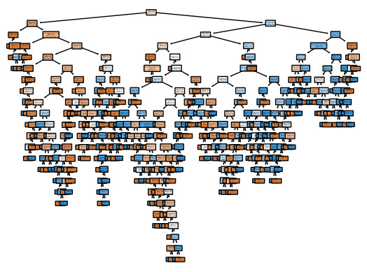

## Origine du projet

L'obésité peut être mesurée avec l'Indice de Masse Corporelle (IMC). L'IMC est une valeur continue.

On classe l'IMC en catégories : poids insuffisant, poids normal, surpoids de niveau I, surpoids de niveau II, obésité de type I, obésité type de II, obésité type de III. Les classements varient, mais ce sont des classements multinomiaux ; à plusieurs catégories.

On peut aussi regrouper les classes obésité pour obtenir un classement binomial ; à deux catégories : non obèse ou obèse.

On entraine le modèle à établir un lien entre une catégorie d'IMC et des facteurs de vie (alimentation, activité, habitudes, etc.) chez des individus. Les facteurs de vie sont les features, les variables explicatives, les variables indépendantes ou x. Chaque individu est une observation ou ligne de données. La variable cible, la variable dépendante ou y est la catégorie d'IMC. L'hygiène de vie détermine la catégorie d'IMC.

Avec de nouvelles données (de nouveaux individus et leurs facteurs de vie), le modèle prédit la catégorie d'IMC de l'individu. La version multinomiale prédit une des 7 catégories. La version binomiale prédit une des 2 catégories.

## Mise en place et structure

Ce sont les étapes (MLOps) qui permettent d'arriver à la **sauvegarde de scalers et de modèles en format Pickle**. Cette sauvegarde permet de pousuivre avec les étapes manquantes du MLOps : le déploiement du modèle.

Consulter les dépôts pour le déploiement du modèle avec Streamlit et les apps interactives : **ml_random_forests_streamlit** et **apps_streamlit**.

### Science des données

1. Préparer les données : importer les données, rectifier la disposition du `DataFrame` de large à long (pivot), nettoyer ou remplacer les valeurs manquantes.
1. Faire une analyse de statistiques descriptives : tendance centrale, dispersion, distribution, valeurs extrêmes, corrélations, visualisation.
1. Manipuler les données : filtres ou extractions conditionnelles, tris, visualisation, etc.

|    |    |
|:---|:---|
| 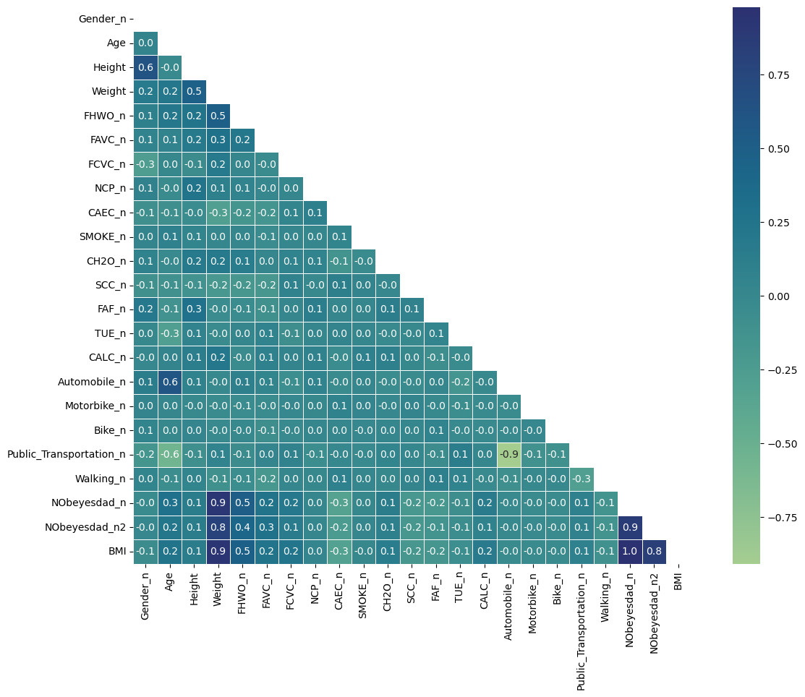 | 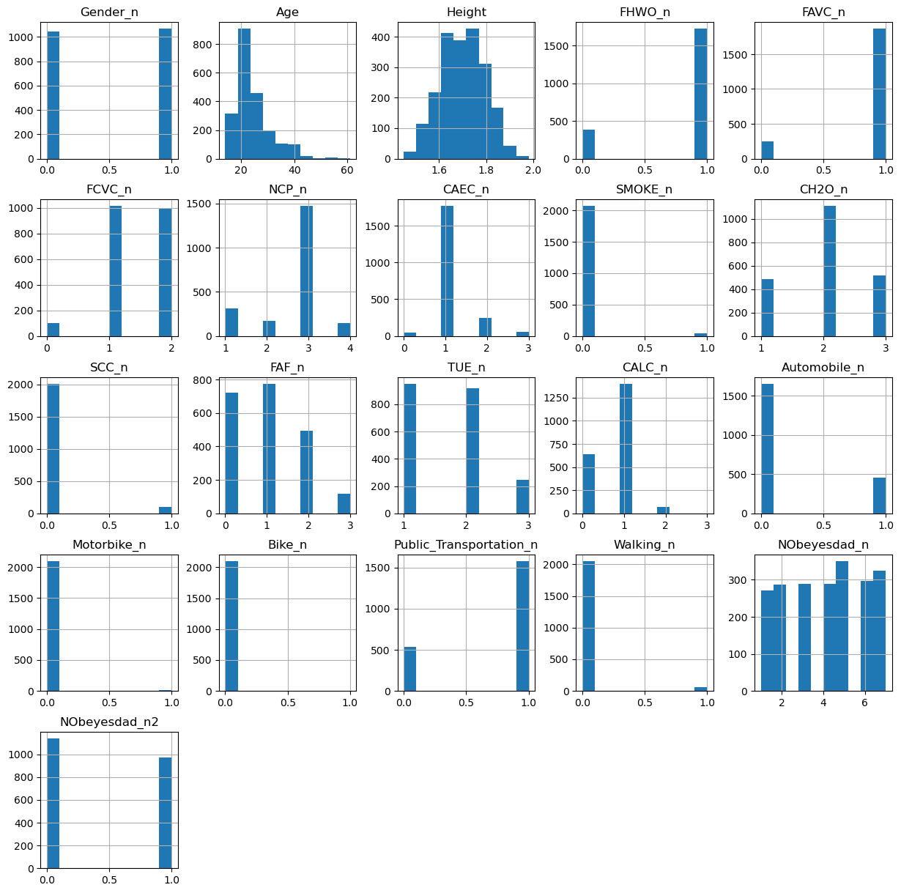 |
| 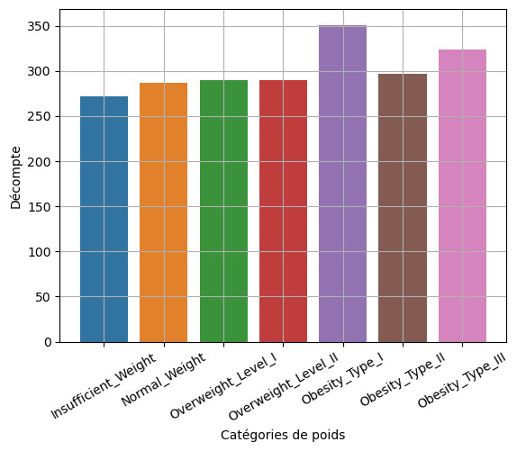 | 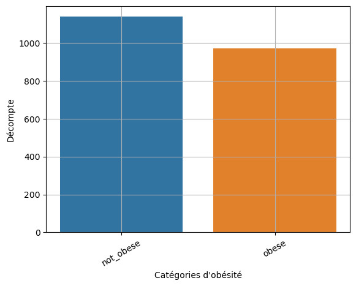 |
| 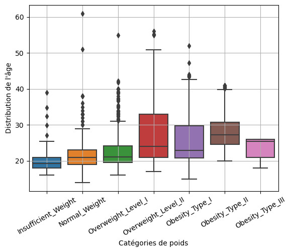 | 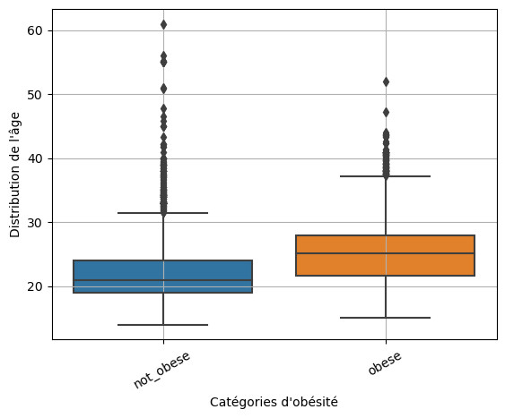 |

### Machine Learning

1. Définir les features (colonnes) et les observations (lignes).
2. Préparer les jeux de données d'entrainement, normaliser et standardiser les données. Cette étape débouche sur la **sauvegarde de scalers**.
    - Normaliser signifie recentrer la distribution de chaque feature en suivant la Loi Normale de sorte que chaque feature ait une moyenne assez similaire. Seule la variance est différente. Ce qui évite qu'un feature avec de larges variances absolues (-1M à 1M) marginalise un autre feature avec de petites variances absolues (-10 à 10). Après normalisation, les deux features se comparent avec des variances relatives avec une moyenne de 0 et une variance autour de 0.
    - Standardiser suit les principes de la normalisation, mais concentre plutôt la variance de chaque feature dans une échelle de 0 à 1.
4. Explorer les possibilités de modèles avant de converger : choix d'un modèle supervisé et de classification.

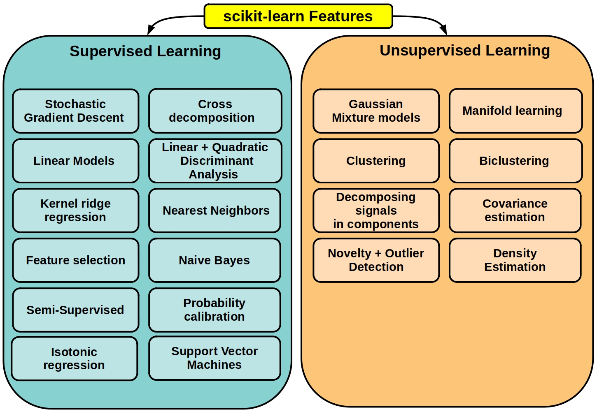

4. Sélectionner un modèle de classification
    - Un modèle de régression logistique est simple et rapide à entrainer. Ce modèle se montre sensible aux données et aux transformations des données d'entrainement ; il souffre de problèmes de biais élevé.
    - Un modèle d'arbre de décision est sensible aux petites variations dans les données d'entrainement. Un léger changement peut entrainer un arbre et une prédiction complètement différents. L'arbre échoue aussi à généraliser avec de nouvelles données, car il a cette tendance au surapprentissage (overfitting).
    - Les modèles d'ensembles sont de meilleures options.
        - Les modèles de boosting (XGBoost, LightGBM) évitent le surapprentissage et réduisent les biais avec des techniques de régularisation et de sous-échantillonnage, par exemple.
        - Les modèles de stacking corrigent les problèmes en combinant les forces de plusieurs types de modèles (par exemple, un arbre de décision, une régression logistique, un autre arbre de décision), évitant qu'un seul modèle ne dicte la prédiction finale et offrant un meilleur pouvoir prédictif global.
        - Les modèles de bagging (Random Forests) ressemblent aux modèles de stacking, mais uniquement un stack d'arbres.
5. Choisir un modèle de Random Forests (modèle d'ensembles de type bagging). Ce sont des modèles simples à maitriser, simples à interpréter, rapide à entrainer et peu intensif en ressources.
5. Entrainer différentes versions.
6. Tester les résultats avec des jeux de données de tests, visualiser les données et les résultats.

Avec les Random Forests, il faut trouver le modèle qui maximise la justesse (accuracy), mais qui optimise le nombre d'arbres de décision. Le score de justesse avec les données de test converge à 94% passé un ensemble de 23 estimateurs ou arbres (le premier arbre de décision est illustré). 125 à 150 estimateurs sont les nombres d'arbres optimaux pour obtenir un score de 94% tout en limitant le temps d'entrainement.

|    |    |
|:---|:---|
|  | 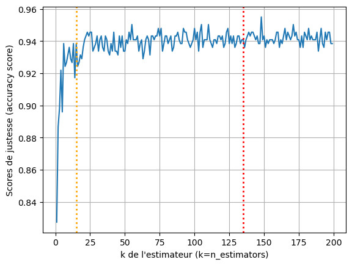 |
| 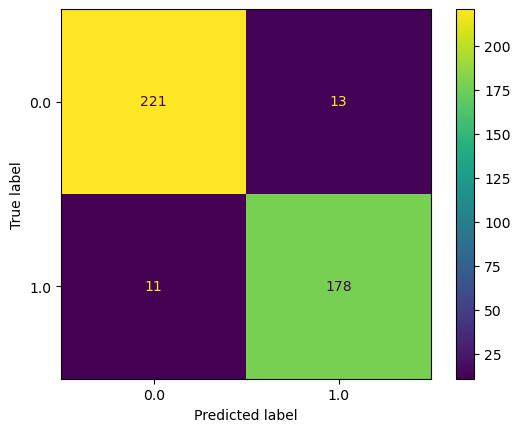 | 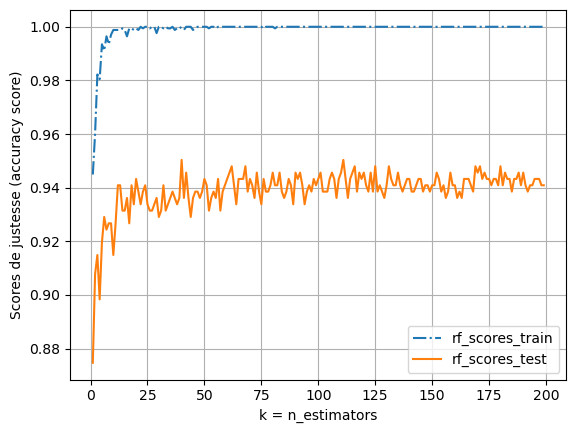 |

Finalement, une configuration du modèle est retenue. Ce modèle est entrainé, évalué et **sauvegardé pour être utilisé en production** (faire des prévisions avec de nouvelles observations).

Consulter le README dans le sous-répertoire du projet pour plus de détails.
