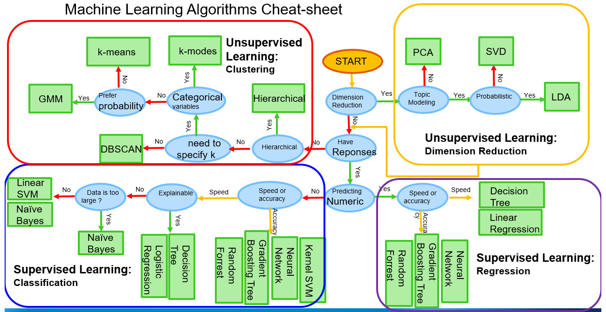

# Machine Learning avec Random Forests

Le projet est une suite d'étapes pour mettre en production un modèle de Machine Learning avec Python. Le modèle doit prédire la propension à l'obésité. Le modèle apprend que l'Indice de Masse Corporelle (IMC) est relié à des facteurs de vie (alimentation, activité, habitudes, etc.). L'hygiène de vie mène à l'obésité ou non. Ces mêmes facteurs servent ensuite à classer si un individu sera obèse à long terme.

L'IMC est une variable continue. On peut établir des catégories. Un poids normal se situe entre 18.5 et 24.9 et l'obésité commence à 30.0. Entre les deux se trouve le surpoids. Deux individus, un à 31.0 et l'autre à 35.0 sont dans la catégorie Obèse. Le premier individu est aussi dans la sous-catégorie Obèse Classe I alors que le deuxième individu est dans la sous-catégorie Obèse Classe II. La catégorie Surpoids se subdivise aussi en sous-catégories.

Le modèle est entrainé en deux versions. La version binomiale (basée sur l'échelle des catégorie; Non Obèse (0) ou Obèse (1)) et la version multinomiale (basée sur l'échelle des sous-catégories).
 
Un autre repo est dédié à la mise en production des deux versions du modèle avec Streamlit.

## Mise en place et structure

### Science des données

1. Préparer les données : importer les données, rectifier la disposition du `DataFrame` de large à long (pivot), nettoyer ou remplacer les valeurs manquantes.
1. Faire une analyse de statistiques descriptives : tendance centrale, dispersion, distribution, valeurs extrêmes, corrélations, visualisation.
1. Manipuler les données : filtres ou extractions conditionnelles, tris, visualisation, etc.

|    |    |
|:---|:---|
|  |  |
|  |  |
|  |  |

### Machine Learning

1. Définir les observations (lignes) et les features (colonnes, variables ou facteurs).
2. Préparer les jeux de données d'entrainement, normaliser et standardiser les données.
3. Explorer les possibilités de modèles avant de converger : choix d'un modèle supervisé et de classification.

4. Sélectionner un modèle de classification
    - Un modèle de régression logistique est simple et rapide à entrainer. Ce modèle se montre sensible aux données et aux transformations des données d'entrainement ; il souffre de problèmes de biais élevé.
    - Un modèle d'arbre de décision est sensible aux petites variations dans les données d'entrainement. Un léger changement peut entrainer un arbre et une prédiction complètement différents. L'arbre échoue aussi à généraliser avec de nouvelles données, car il a cette tendance au surapprentissage (overfitting).
    - Les modèles d'ensembles sont de meilleures options.
        - Les modèles de boosting (XGBoost, LightGBM) évitent le surapprentissage et réduisent les biais avec des techniques de régularisation et de sous-échantillonnage, par exemple.
        - Les modèles de stacking corrigent les problèmes en combinant les forces de plusieurs types de modèles (par exemple, un arbre de décision, une régression logistique, un autre arbre de décision), évitant qu'un seul modèle ne dicte la prédiction finale et offrant un meilleur pouvoir prédictif global.
        - Les modèles de bagging (Random Forests) ressemblent aux modèles de stacking, mais uniquement un stack d'arbres.
5. Choisir un modèle de Random Forests (modèle d'ensembles de type bagging). Ce sont des modèles simples à maitriser, simples à interpréter, rapide à entrainer et peu intensif en ressources.
5. Entrainer différentes versions.
6. Tester les résultats avec des jeux de données de tests, visualiser les données et les résultats.

Avec les Random Forests, il faut trouver le modèle qui maximise la justesse (accuracy), mais qui optimise le nombre d'arbres de décision. Le score de justesse avec les données de test converge à 94% passé un ensemble de 23 estimateurs ou arbres (le premier arbre de décision est illustré). 125 à 150 estimateurs sont les nombres d'arbres optimaux pour obtenir un score de 94% tout en limitant le temps d'entrainement.

|    |    |
|:---|:---|
|  |  |
|  |  |

Finalement, une configuration du modèle est retenue. Ce modèle est entrainé, évalué et sauvegardé pour être utilisé en production (faire des prévisions avec de nouvelles observations).

Consulter le README dans le dossier du projet pour plus de détails.
